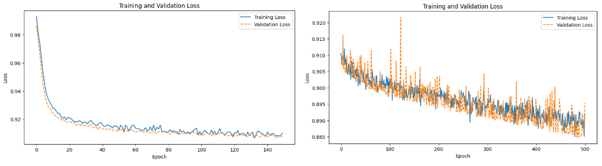

# Particle Detection in Cryo-Electron Tomography (cryoET)

## Project Overview
This project focuses on the automated detection and annotation of protein complexes in cryo-electron tomography (cryoET) data. The dataset consists of several tomograms, each with ground truth annotations specifying the x, y, and z positions of particles. The primary objective is to implement and evaluate a V-Net model with residual connections on a curated cryoET dataset containing five distinct classes of protein complexes. The results provide insights into the strengths and limitations of this approach, contributing to the advancement of automated protein annotation systems.
## Results

The V-Net model was evaluated on six different particle classes using two different loss metrics. Experiments were conducted with two learning rates: $1 \times 10^{-4}$ and $5 \times 10^{-4}$. The table below summarizes the main results:

| Metric     | Learning Rate: $1 \times 10^{-4}$ | Learning Rate: $5 \times 10^{-4}$ |
|------------|:---------------------------------:|:----------------------------------:|
| Accuracy   | 0.987                             | 0.9761                             |
| Precision  | 0.0534                            | 0.0577                             |
| Recall     | 0.3052                            | **0.4285**                         |
| F1 Score   | 0.091                             | **0.1017**                         |

**Note:** Bold values indicate the best results for each metric. The model achieved high accuracy, with the best recall and F1 score obtained at a learning rate of $5 \times 10^{-4}$. These results highlight the importance of tuning hyperparameters and loss functions for optimal detection of different particle types in cryoET data.
## Figures

Below are two representative figures from the project:

**1. Example of Mask and Prediction for a Particle**


This figure shows the ground truth mask and the model's prediction for one of the particle classes, illustrating the segmentation performance of the V-Net.

**2. Training and Validation Loss Curves**



This plot displays the training and validation loss over epochs, demonstrating the model's learning progress and generalization ability.
## Technologies Used
- **Python**: Main programming language for data processing and model implementation.
- **PyTorch**: Deep learning framework used for building and training the V-Net model.
- **TensorFlow**: Used for additional deep learning utilities and GPU management.
- **scikit-image, matplotlib**: For image processing and visualization.
- **cupy-cuda12x**: GPU-accelerated array computation.
- **kaggle, kaggle-cli**: For dataset download and management.
- **pandas, numpy, zarr**: For data manipulation and storage.
- **tqdm**: For progress visualization.

## File Descriptions
- **V-Net.ipynb**: Main Jupyter notebook containing code for data preprocessing, V-Net model implementation, training, evaluation, and visualization. It includes all necessary steps to reproduce the experiments and results described in the project.
- **requirements.txt**: Lists all Python dependencies required to run the notebook and reproduce the results. This includes deep learning frameworks, data processing libraries, and utilities for working with cryoET data.

## Installation
1. Clone the repository:
   ```bash
   git clone <repository-url>
   cd Particle-detection
   ```
2. (Optional) Create and activate a virtual environment:
   ```bash
   python3 -m venv venv
   source venv/bin/activate
   ```
3. Install dependencies:
   ```bash
   pip install -r requirements.txt
   ```

## Usage
1. Download the dataset using the provided Kaggle commands in the notebook.
2. Open `V-Net.ipynb` in Jupyter or VS Code.
3. Follow the notebook cells to preprocess data, train the V-Net model, and evaluate results.
4. Modify model parameters or architecture as needed for experimentation.

## Dependencies
All dependencies are listed in `requirements.txt`. Key packages include:
- torch
- torchvision
- tensorflow
- scikit-image
- matplotlib
- cupy-cuda12x
- kaggle
- kaggle-cli
- pandas
- numpy
- zarr
- tqdm
- copick
- torchviz

## Citation
If you use this project or dataset, please cite the original dataset authors and this repository.

---
For questions or contributions, please open an issue or submit a pull request.
